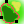

Landscape Connectivity Toolbox           
===================================================================

**Version: 0.1**

**Supported QGIS version: 2.x**

**Licence: GNU GPLv3**

Description
-------------

Landscape Connectivity Toolbox is a QGIS plugin conceived as a toolbox for the study of landscape. It enables the user to model landscape mobility and flow according to least-cost path networks and circuit theory models from the open-source software <a href="https://circuitscape.org/">Circuitscape</a>. It presents the algorithms in the same tool in order to ease the usage of both approaches as complementary. The LCP Network algorithm is borrowed from the <a href="https://github.com/xrubio/LCPNetwork/">LCP Network plugin</a>, which has been adapted for the current toolbox. The implementation of the Circuitscape provider is based on a previous <a href="https://github.com/alexbruy/processing-circuitscape/">QGIS plugin</a>.

The plugin is accessed through the QGIS Processing Toolbox.

It is necessary to <a href="https://circuitscape.org/downloads/" target="_blank">install Circuitscape</a> before the installation of the plugin.

## Least-Cost Path Network 

The plugin applies the shortest path algorithm developed by Edsger W. Dijkstra to find the optimal path between two points. It takes a **vector layer** with points and calculates the optimal route between all of them across a **cost surface raster**. The network path is provided in a single line vector layer. Moreover, it creates a raster layer that contains the accumulated cost for each of the points .

## Circuitscape 

From the toolbox, a **vector layer** with multiple points is required as the focal node. The tool automatically extracts the coordinates from QGIS and creates a unique ID for each point. It is also possible to provide a **cost surface raster** as a focal node. On the other hand, it is also necessary to specify one **raster file** as the resistance map with the cost values (resistances), which is automatically translated to ESRI ASCII.
Circuitscape provides four modelling modes (Pairwise, Advanced, One-To-All and All-To-One) that are enabled through the toolbox. For further reference on the differences and the output, please check <a href="https://circuitscape.org/circuitscape_4_0_user_guide.html">Circuitscape's user guide</a>.

Installation
--------------

You can find the installation instructions in the following <a href="https://www.academia.edu/37835758/How_to_install_the_QGIS_plugin_Landscape_Connectivity_Toolbox/">document</a>.

Developed by Guillem Domingo (guillem.dri@gmail.com) as part of the <a href="https://www.geos.ed.ac.uk/~mscgis/17-18/s1788539//">MSc GIS dissertation</a> at the University of Edinburgh.
